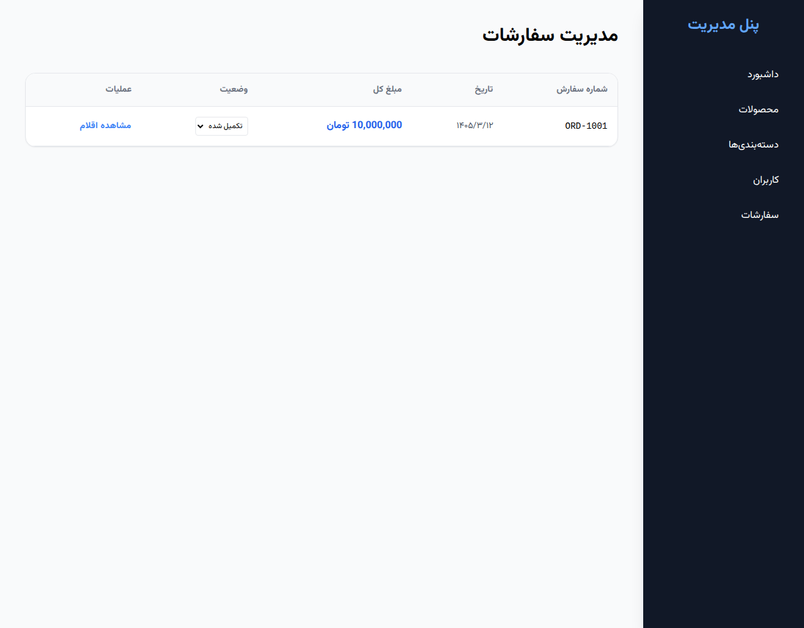
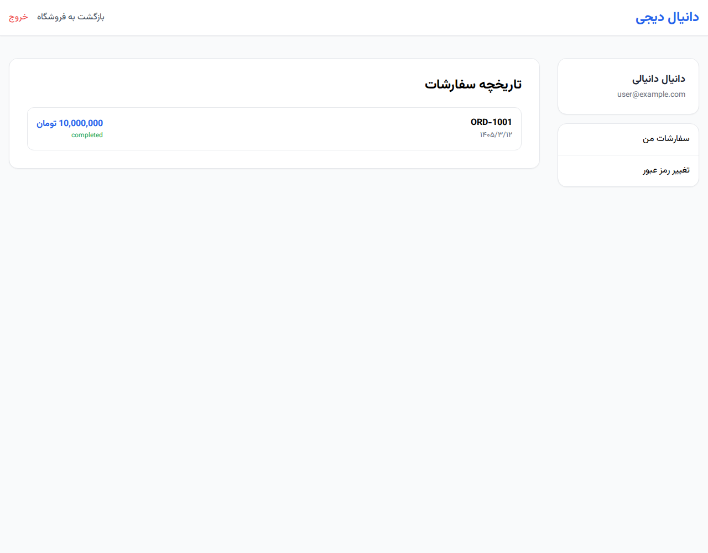

# دانیال دیجی (Danial Digi)

یک پلتفرم کامل و حرفه‌ای فروشگاهی با الهام از دیجی کالا، شامل پنل مدیریت پیشرفته، پنل کاربری و API قدرتمند.

## ویژگی‌های دانیال دیجی
- **برندینگ اختصاصی:** نام دانیال دیجی در تمامی بخش‌های اپلیکیشن.
- **پنل کاربری (Profile):** مشاهده تاریخچه سفارشات و تغییر رمز عبور.
- **مدیریت درختی دسته‌بندی‌ها:** ساختار چند‌سطحی برای سازماندهی محصولات.
- **ویژگی‌های فنی محصول (Attributes):** ثبت مشخصات دقیق مانند رم، حافظه، رنگ و غیره.
- **گالری تصاویر:** پشتیبانی از چندین عکس برای هر محصول.
- **پنل مدیریت چند‌سطحی:**
  - **مدیر کل:** دسترسی به تنظیمات سیستم، مدیریت کاربران، نقش‌ها و تمامی تراکنش‌ها.
  - **مدیر فروش:** تمرکز بر مدیریت کالاها، موجودی و پردازش سفارشات.
- **طراحی مدرن و پاک:** حذف ایموجی‌ها و استفاده از رابط کاربری مینیمال و حرفه‌ای.
- **API استاندارد:** مستندات کامل برای اتصال اپلیکیشن‌های اندروید و iOS.

## راهنمای نصب

۱. **نصب پیش‌نیازها:**
   ```bash
   npm install
   ```

۲. **راه‌اندازی داده‌ها:**
   ```bash
   npm run seed
   ```

۳. **اجرا:**
   ```bash
   npm start
   ```

## حساب‌های کاربری دمو
- **مدیر کل:** `admin@example.com` / `admin123`
- **مدیر فروش:** `sales@example.com` / `sales123`
- **مشتری:** `user@example.com` / `user123`

## پیش‌نمایش

### فروشگاه


### داشبورد مدیریت


### مدیریت محصولات


### مدیریت سفارشات


### پنل کاربری مشتری (پروفایل)


---
ساخته شده برای ارائه یک تجربه خرید عالی.
