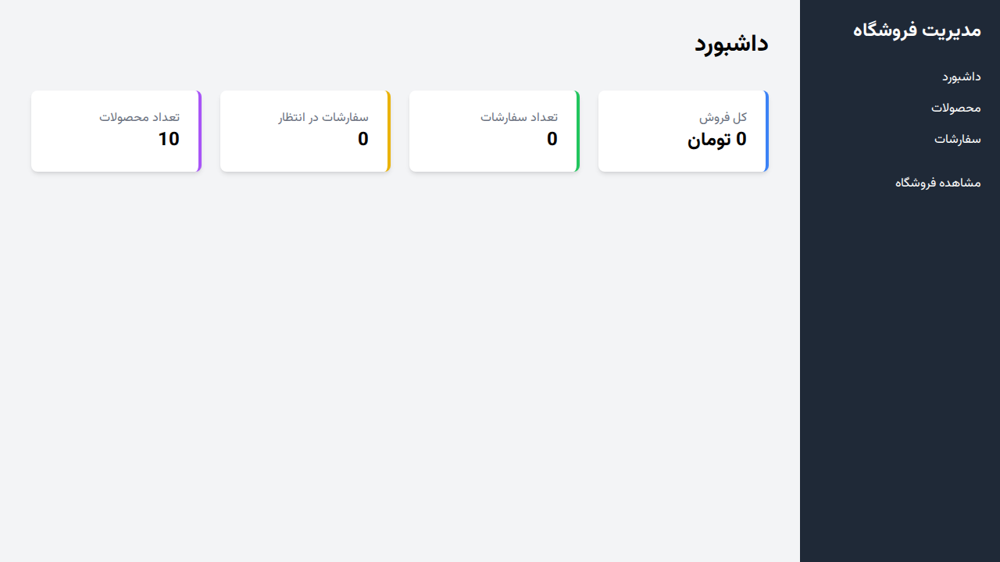
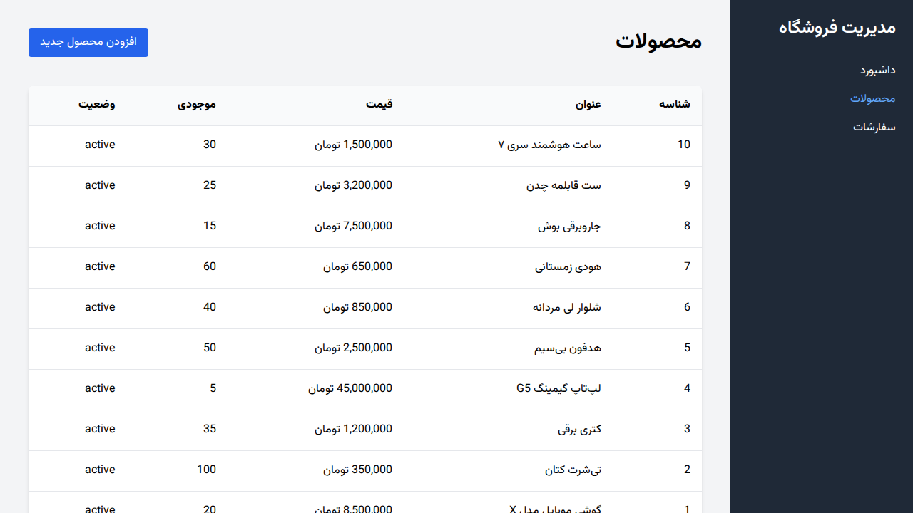
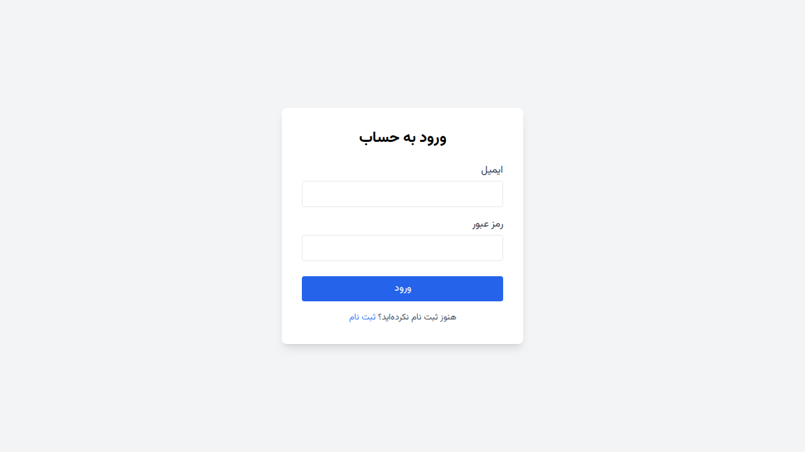

# فروشگاه آنلاین نود (NodeShop)

این یک پروژه کامل فروشگاهی شامل API، پنل مدیریت و رابط کاربری فروشگاه است.

## ویژگی‌ها
- **API کامل:** پیاده‌سازی شده با Express و Sequelize.
- **پنل مدیریت:** مدیریت محصولات، مشاهده آمار فروش و وضعیت سفارشات.
- **رابط کاربری فروشگاه:** مشاهده محصولات، سبد خرید، آدرس‌دهی و ثبت سفارش.
- **سیستم احراز هویت:** بر پایه JWT (ادمین و مشتری).
- **داده‌های نمونه (Seed):** دارای اسکریپت خودکار برای ایجاد داده‌های اولیه.

## نحوه راه‌اندازی

۱. **نصب وابستگی‌ها:**
   ```bash
   npm install
   ```

۲. **ایجاد داده‌های اولیه:**
   ```bash
   npm run seed # یا node src/scripts/seed.js
   ```

۳. **اجرای پروژه:**
   ```bash
   npm start # یا node src/server.js
   ```
   پروژه روی `http://localhost:3000` اجرا می‌شود.

## دسترسی‌ها
- **فروشگاه:** `http://localhost:3000/shop/index.html`
- **پنل مدیریت:** `http://localhost:3000/admin/index.html` (نیاز به ورود با اکانت ادمین دارد)
- **اکانت ادمین پیش‌فرض:** `admin@example.com` / `admin123`
- **اکانت مشتری پیش‌فرض:** `user@example.com` / `user123`

## اسکرین‌شات‌ها

### صفحه اصلی فروشگاه


### پنل مدیریت - داشبورد


### پنل مدیریت - لیست محصولات


### صفحه ورود


## مستندات API
برای استفاده در اپلیکیشن موبایل، فایل `readmeapi.md` را مطالعه کنید.
